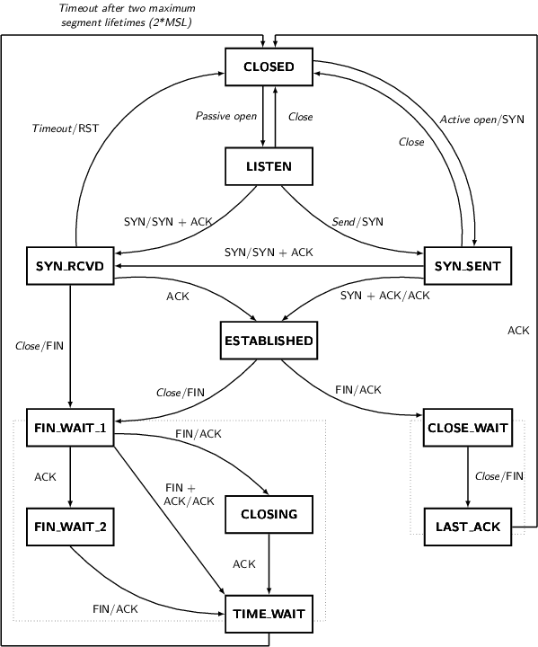
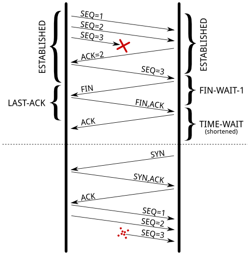

[原文链接](http://vincent.bernat.im/en/blog/2014-tcp-time-wait-state-linux.html)

Linux内核文档没有很好的解释`net.ipv4.tcp_tw_recycle`选项的作用.

下面的介绍引用自Linux内核文档:

允许内核快速回收处于`TIME-WAIT`状态的`socket`.默认值是0,
在没有技术专家的建议下最好别改变默认值.

他的兄弟`net.ipv4.tcp_tw_reuse`选项文档描述得稍微清楚一点，但依旧只有三言两语:

当一个新连接到来时允许重用处于`TIME-WAIT`状态的`socket`,只要在协议的角度上看是安全的.默认值是0,在没有技术专家的建议下最好别改变默认值.

文档的缺乏导致出现了很多文章建议我们将这两个值设置为1,以减少处于`TIME-WAIT`状态的`socket`的数量.但是,正如在`tcp(7)`manual page中阐述的,在面向公网的网络服务器上开启`net.ipv4.tcp_tw_recycle`选项将会导致一些问题.因为服务器无法处理隐藏在同一台NAT设备后的不同计算机的连接.

因此`net.ipv4.tcp_tw_recycle`选项不建议开启.

尽管这个选择的名字中带有`ipv4`,实际上它同样被应用于IPv6套接口.

##TIME-WAIT状态

首先回顾一下`TIME-WAIT`,下图展示了`socket`如何在各状态之间迁移.

从上图可以看到，只有主动调用`close`的一方在回到`CLOSED`状态之前必须要先迁移到`TIME-WAIT`状态.

你可以通过`ss -tan`查看当前所有`socket`的状态:

	$ ss -tan | head -5
	LISTEN     0  511             *:80              *:*     
	SYN-RECV   0  0     192.0.2.145:80    203.0.113.5:35449
	SYN-RECV   0  0     192.0.2.145:80   203.0.113.27:53599
	ESTAB      0  0     192.0.2.145:80   203.0.113.27:33605
	TIME-WAIT  0  0     192.0.2.145:80   203.0.113.47:50685

###目的

`TIME-WAIT`状态存在的目的有两个:

1)防止之前连接的迷途分组被之后建立的与之前的连接有相同四元组(源地址:源端口,目地地址:目地端口)的接连作为合法分组接收.

[RFC1337](http://tools.ietf.org/html/rfc1337)分析了如果`TIME-WAIT`状态的时间太短会导致什么问题.下面是一个示例，如果我们没有将`TIME-WAIT`状态的时间缩短，就可以避免此类问题的发生:

因为`TIME-WAIT`状态的时间被缩短导致一个延时的TCP分组被一个不相关的连接接收.

2)确保被动关闭方正确的关闭连接.如果最后的ACK确认丢失,被动关闭方的连接将会停留在`LAST-ACK`状态.这个时候主动关闭方请求建立一个到被动关闭方的连接且这个连接重用了之前连接的四元组(源地址:源端口,目地地址:目地端口),如果没有`TIME-WAIT`状态,被动关闭方会认为之前的连接依旧有效,但被动关闭方收到新连接过来的SYN(序列号匹配),它将响应一个RST这将导致新建连接的失败:	

如果被动关闭方因为最后的ACK丢失而保持在`LAST-ACK`状态,使用这个老连接的四元组来建立新连接将会失败.

[RFC793](http://tools.ietf.org/html/rfc793)要求`TIME-WAIT`的持续时间必须是两倍的MSL.
在Linux上，这个时间是不能被改变的,它定义在`include/net/tcp.h`中，时间是1分钟:

	#define TCP_TIMEWAIT_LEN (60*HZ) /* how long to wait to destroy TIME-WAIT
                                  * state, about 60 seconds     */

曾经有[提议](http://comments.gmane.org/gmane.linux.network/244411)将这个值调整为可被改变的，但这个提议被否决了.

###问题

现在让我们看一下为什么`TIME-WAIT`状态在一个处理大量连接的服务器上是令人讨厌的.问题主要有三方面:

1)`TIME-WAIT`状态的`socket`在连接管理表中占用了一个位置，导致相同类型的新连接无法建立.

2)`TIME-WAIT`状态的`socket`将占用一定的内存.

3)`TIME-WAIT`状态的`socket`占用了额外的CPU.

The result of `ss -tan state time-wait | wc -l` is not a problem per se!

####占用连接管理表的位置
一个处于`TIME-WAIT`状态的连接将会在连接管理表中存放一分钟,这意味在这一分钟之内，我们无法建立一个有着同样4元组的新连接.

对一个web服务器而言，目地地址和目地端口通常是固定的.如果你的服务器部署在一个L7负载均衡器的后面，那么源地址也是固定的.在Linux上,客户端连接可以使用的端口范围大概只有30000个(可以通过`net.ipv4.ip_local_port_range调整`).这意味着每分钟只能在web服务器和负载均衡器之间建立30000个连接,平均每秒500个.

如果`TIME-WAIT`在客户端(负载均衡器),这个问题相对容易发现,`connect()`调用将返回错误`EADDRNOTAVAIL`应用程序会将这个错误记录到日志中.如果在服务器端这个问题就复杂多了,没有任何的日志会通知你问题的原因.你只能通过列出当前所有的4元组来发现这个问题:

	$ ss -tan 'sport = :80' | awk '{print $(NF)" "$(NF-1)}' | \
	>     sed 's/:[^ ]*//g' | sort | uniq -c
	    696 10.24.2.30 10.33.1.64
	   1881 10.24.2.30 10.33.1.65
	   5314 10.24.2.30 10.33.1.66
	   5293 10.24.2.30 10.33.1.67
	   3387 10.24.2.30 10.33.1.68
	   2663 10.24.2.30 10.33.1.69
	   1129 10.24.2.30 10.33.1.70
	  10536 10.24.2.30 10.33.1.73

解决方案是允许更多的4元组.这可以通过下面几个方法实现(实现难度递增):

1)调整`net.ipv4.ip_local_port_range`扩大客户端的端口范围.

2)让web服务器监听更多的端口.

3)在负载均衡器上配置更多的客户端IP,并且以轮询的方式使用这些IP去与web服务器建立连接.

4)让web服务器监听更多的IP地址.

当然还有最后一个方案，就是调整`net.ipv4.tcp_tw_reuse`和`net.ipv4.tcp_tw_recycle`,但是，先别忙着就这么做了，后面的内容会分析这两个设置.

####内存

`TIME-WAIT`状态的连接将会占用服务器的内存.例如,如果你每秒钟要处理10,000个新连接，那么将会有600,000个`socket`处于`TIME-WAIT`状态.这会占用多大的内存?

首先在应用程序看来`TIME-WAIT`的`socket`并没有消耗内存，因为那个`socket`已经关闭了.而对于内核来说,`TIME-WAIT`的`socket`在3个地方占用了内存(为了3种不同的目的):

1) 连接哈希表,用于快速定位一个存在的连接,例如当收到一个分组时定位这个分组属于哪个连接.
这个哈希表的每个桶中都保存了两个链表，一个用于存放`TIME-WAIT`状态的连接一个用于存放正常状态的
连接.哈希表的大小依赖于系统内存的大小，我们可以通过以下命令查看:

	$ dmesg | grep "TCP established hash table"
	[    0.169348] TCP established hash table entries: 65536 (order: 8, 1048576 bytes)

我们可以通过内核命令行加`thash_entries`参数来调整entries的数量.

`TIME-WAIT`列表中的每个元素是一个`struct tcp_timewait_sock`结构体，而正常状态列表中的元素是`struct tcp_sock`结构体:

	struct tcp_timewait_sock {
	    struct inet_timewait_sock tw_sk;
	    u32    tw_rcv_nxt;
	    u32    tw_snd_nxt;
	    u32    tw_rcv_wnd;
	    u32    tw_ts_offset;
	    u32    tw_ts_recent;
	    long   tw_ts_recent_stamp;
	};
	
	struct inet_timewait_sock {
	    struct sock_common  __tw_common;
	
	    int                     tw_timeout;
	    volatile unsigned char  tw_substate;
	    unsigned char           tw_rcv_wscale;
	    __be16 tw_sport;
	    unsigned int tw_ipv6only     : 1,
	                 tw_transparent  : 1,
	                 tw_pad          : 6,
	                 tw_tos          : 8,
	                 tw_ipv6_offset  : 16;
	    unsigned long            tw_ttd;
	    struct inet_bind_bucket *tw_tb;
	    struct hlist_node        tw_death_node;
	};

2) 一组连接链表，每个链表中的连接在相同的时间`TIME-WAIT`到期.这组链表按到期的剩余时间从小到大排序.这个链表中的元素不占用额外的内存，因为它使用的是`struct inet_timewait_sock`中的`struct hlist_node tw_death_node`成员.

3) 已绑定端口的哈希表，保存本地绑定的端口和相关的参数.用于检测是否可以安全的监听一个给定的端口，或者查找一个可用的端口用于动态绑定.这个哈希表的大小与连接哈希表保持一致:

	$ dmesg | grep "TCP bind hash table"
	[    0.169962] TCP bind hash table entries: 65536 (order: 8, 1048576 bytes)

哈希表中的元素是一个`struct inet_bind_socket`结构。每个本地绑定的端口在哈希表中占用一项.
web服务器的`TIME-WAIT`连接被绑定到80端口,所有被绑定在80端口的`TIME-WAIT`连接共享一个entry.

所以，我们现在可以将注意力集中在`struct tcp_timewait_sock`和`struct inet_bind_socket`的内存占用上.每个`TIME-WAIT`的连接都有一个对应的`struct tcp_timewait_sock`,不管它是inbound还是outbound.而对于每一个outbound的连接会有一个对应的`struct inet_bind_socket`.

`struct tcp_timewait_sock`占用168个字节`struct inet_bind_socket`占用48个字节:

	$ sudo apt-get install linux-image-$(uname -r)-dbg
	[...]
	$ gdb /usr/lib/debug/boot/vmlinux-$(uname -r)
	(gdb) print sizeof(struct tcp_timewait_sock)
 	$1 = 168
	(gdb) print sizeof(struct tcp_sock)
 	$2 = 1776
	(gdb) print sizeof(struct inet_bind_bucket)
 	$3 = 48

所以如果我们有40,000个inbound的连接处于`TIME-WAIT`状态,只需要额外消耗最多10MB的内存.而如果是40,000个outbound的连接也就额外的消耗最多2.5MB内存.我们来看下`slabtop`的输出。下面的输出来自在一个有50,000个连接处于`TIME-WAIT`状态,其中45,000是outbound连接的服务器：

	$ sudo slabtop -o | grep -E '(^  OBJS|tw_sock_TCP|tcp_bind_bucket)'
	  OBJS ACTIVE  USE OBJ SIZE  SLABS OBJ/SLAB CACHE SIZE NAME                   
	 50955  49725  97%    0.25K   3397       15     13588K tw_sock_TCP            
	 44840  36556  81%    0.06K    760       59      3040K tcp_bind_bucket

从以上分析来看，`TIME-WAIT`状态导致的内存开销几乎可以忽略不计.

####CPU

另一方面，查找本地空闲端口可能会增加一点点额外的开销.这个查找工作由[`inet_csk_get_port()`函数](http://lxr.free-electrons.com/source/net/ipv4/inet_connection_sock.c?v=3.12#L104)完成,它的内部实现中使用了一个锁,遍历所有的本地绑定端口，直到找到一个空闲的端口.如果这个哈希表中的大多数元素都是处于`TIME-WAIT`状态的outbound连接,这不会导致太大的影响(例如到memcached服务器的段连接)：这些连接通常共享同样的配置,所以`inet_csk_get_port()`可以很快的找到一个空闲的端口.

###其它解决方案

在看完前面的内容之后，如果你依旧为`TIME-WAIT`连接感到苦恼，可以看下下面3个额外的解决方案:

1) 关闭套接口的lingering选项

2) `net.ipv4.tcp_tw_reuse`

3) `net.ipv4.tcp_tw_recycle`

####lingering选项

当`close()`被调用,套接口内核缓冲中的数据会在后台发送，这个套接口最终会迁移到`TIME-WAIT`状态.应用程序可以假设这些数据最终会被安全的发送出去.

但是一个应用程序可以选择改变这种行为,通过改变lingering选项，可以在调用`close`之后有以下两种行为之一:

1) 丢弃内核缓冲中的数据,不走正常终止连接的4个分组而是直接往对端发送一个RST(对端连接会检测到一个错误)然后立即销毁对应的`socket`，这种方式下连接将不会进入`TIME-WAIT`状态.

2) 如果连接的发送缓冲中还有数据,阻塞`close()`直到数据发送完成并且被对端确认或者linger超时.如果我们选择将套接口设置为非阻塞的来避免阻塞在`close`上.上面的过程将会在后台异步执行,如果在设定的超时到期之前数据成功发送将执行正常的关闭连接的4个分组并且将连接迁移到`TIME-WAIT`状态.否则数据将被丢弃通过向对端发送一个RST来终止连接.

无论哪种情况，禁用lingering选项都不是一个万全的解决方案。除非有充分的理由，否则请不要禁止lingering选项.

####`net.ipv4.tcp_tw_reuse`

`TIME-WAIT`状态防止一个延时分组被不相关的连接接收.但是，在某些情况下可以假设来自新连接的分组不会被误解成是来自老连接的.

[RFC 1323](http://tools.ietf.org/html/rfc1323)介绍了一组TCP扩展用于提高高带宽线路的性能.除此之外，还定义一个新的TCP选项,用于携带两个4字节的时间戳字段.第一个时间戳是TCP发送这个选项时的时间.
第二个是最近一次从远端接收到分组的时间.

通过开启`net.ipv4.tcp_tw_reuse`选项,Linux可以将一个处于`TIME-WAIT`状态的连接作为新的外出连接重用.只要建立新连接的时间严格大于最近一次从远端接收到分组的时间，也就是说:如果一个外出连接处于`TIME-WAIT`状态,那么这个连接在一秒钟之后就可以被重用.

这么做安全吗?答案是肯定的.`TIME-WAIT`状态的一个目的就是为了防止一个重复的分组被不相关的连接接收.而在有了额外的时间戳之后,重复的分组因为携带了过期的时间戳而被丢弃.

第二个目的是为了确保被动关闭方可以在丢失最后一个ACK的情况下正确的结束一个连接.被动关闭方会重发FIN分组直到:

1) 主动放弃(结束连接)

2) 接收到它正在等待的ACK(结束连接)

3) 接收到RST(结束连接)

如果那个重发的FIN分组被主动关闭方及时收到，此时主动关闭方仍然处于`TIME-WAIT`状态，它响应对方一个ACK分组.

