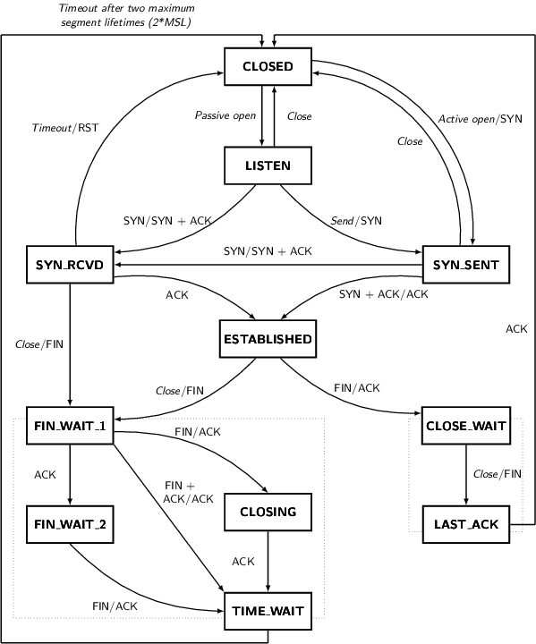

在一个繁忙的Linux网络服务器上，将会遇到大量套接口进入`TIME-WAIT`状态,导致新连接无法迅速建立的问题,本文详细分析了`TIME-WAIT`状态的作用并提供了一些处理这个问题的解决方案.

####术语

* TCP连接4元组:一个TCP连接由一个四元组(源ip:源端口，目地ip:目地端口)唯一定义.

* 主动关闭方:主动对一个存活连接调用`close`的一方.

* 被动关闭方:因为对端调用`close`使得连接终止而被动终止连接的一方. 

* 迷途或延时分节:

[原文链接](http://vincent.bernat.im/en/blog/2014-tcp-time-wait-state-linux.html)

Linux中提供了两个选项以改变`TIME-WAIT`状态的处理，分别是:

* `net.ipv4.tcp_tw_recycle`

* `net.ipv4.tcp_tw_reuse`

Linux内核文档没有清楚的解释`net.ipv4.tcp_tw_recycle`选项的作用.

下面的介绍引用自Linux内核文档:

	允许内核快速回收处于TIME-WAIT状态的socket.默认值是0(关闭),
	在没有技术专家的建议下最好别改变默认值.

而对于它的兄弟选项`net.ipv4.tcp_tw_reuse`,文档描述得稍微清楚一点，但依旧只是三言两语:

	当建立新连接时允许重用处于TIME-WAIT状态的socket,只要在协议的角度上看是安全的.
	默认值是0(关闭),在没有技术专家的建议下最好别改变默认值.(注：新连接使用了跟老连接一样的4元组)

文档的缺乏使得网上出现了很多文章，建议我们开启上述两选项,以减少处于`TIME-WAIT`状态的`socket`数量.但是,正如在`tcp(7) manual page`中阐述的,在面向公网的服务器上开启`net.ipv4.tcp_tw_recycle`选项将会产生一些问题.因为服务器无法区分一台NAT设备后面分别属于
两台机器的连接(NAT设备后的机器都通过NAT设备来连接服务器，所以服务器无法区分这两个连接是否来自于不同的机器).

	因此不建议开启快速回收处于TIME-WAIT状态socket的选项(net.ipv4.tcp_tw_recycle),
	因为在一个混杂了NAT设备的网络环境下，它的开启可能会产生一些问题.

这就是我写这篇文章的目的，让更多的程序员减少犯类似错误的可能性:

注意，尽管这两个选择的名字中带有`ipv4`,而实际上它同样被应用于IPv6套接口.其次，我们关注的只是Linux上的TCP协议栈,这与Netfilter连接的跟踪没有任何关系,后者需要通过其它方式调整(1).

###目录

*	TIME-WAIT状态详解
>*	目的
>*	问题
>>*		Connection table slot
>>*		Memory
>>*		CPU

*	其它解决方案
>*		套接口的lingering选项
>*		net.ipv4.tcp_tw_reuse
>*		net.ipv4.tcp_tw_recycle

*	总结

##TIME-WAIT状态

进入正文，我们首先来看一下什么是`TIME-WAIT`状态，它存在的主要目的是什么,请看下面的TCP状态迁移图(2):

从上图可以看到,一个处于`ESTABLISHED`状态的`socket`在主动调用`close`之后要想迁移到`CLOSED`状态(为什么回到`CLOSED`是重要的？从图中可以看到,`CLOSED`是所有新连接的起点，也就是说如果一个`socket`没有回到`CLOSED`状态，我们就无法再重新使用它).那么它必须经过`TIME-WAIT`状态.

你可以通过`ss -tan`查看当前所有`socket`的状态:

	$ ss -tan | head -5
	LISTEN     0  511             *:80              *:*     
	SYN-RECV   0  0     192.0.2.145:80    203.0.113.5:35449
	SYN-RECV   0  0     192.0.2.145:80   203.0.113.27:53599
	ESTAB      0  0     192.0.2.145:80   203.0.113.27:33605
	TIME-WAIT  0  0     192.0.2.145:80   203.0.113.47:50685

###目的

既然`TIME-WAIT`是一个必经路径，那么我们来看下它到底为什么有存在的价值.

`TIME-WAIT`状态存在的目的有两个:

1)假设连接C被服务器主动关闭,之后服务器与客户端之间又建立了一个新的连接CC,并CC的四元组与C一样.这个时候如果在网卡中接收到一个来自老连接C的迷途分节,如果没有`TIME-WAIT`状态,会导致这个迷途分组错误的被CC接收.[RFC1337](http://tools.ietf.org/html/rfc1337)分析了如果`TIME-WAIT`状态的时间被设置得太短会导致什么问题(3).下面是一个示例，如果我们没有将`TIME-WAIT`状态的时间缩短，就可以避免此类问题的发生:

因为`TIME-WAIT`状态的时间被缩短导致一个延时的TCP分节被一个不相关的连接接收.

2)确保被动关闭方能正确的终止一个连接.连接的关闭会导致连接之间传送4个分节(参考Unix网络编程),假设最后的`ACK`分节丢失,那么被动关闭方将会一直停留在`LAST-ACK`状态(4).这里假设连接是C,如果没有`TIME-WAIT`状态,当服务器向客户端尝试使用C的4元组建立新的连接CC时,客户端会认为连接C还是有效的.当客户端收到`SYN`(序列号正好匹配，关于分节序列号请参考Unix网络编程),会收到一个分预期的`SYN`分节而响应一个`RST`分节.新建连接的请求会失败并返回错误:

如果被动关闭方因为最后的ACK丢失而保持在`LAST-ACK`状态,使用这个老连接的四元组来建立新连接将会失败.

[RFC793](http://tools.ietf.org/html/rfc793)要求`TIME-WAIT`的持续时间必须是两倍的MSL.
在Linux上，这个时间是不能被改变的,它定义在`include/net/tcp.h`中，时间是1分钟:

	#define TCP_TIMEWAIT_LEN (60*HZ) /* how long to wait to destroy TIME-WAIT
                                  * state, about 60 seconds     */

曾经有[提议](http://comments.gmane.org/gmane.linux.network/244411)将这个值调整为可被改变的，但这个提议被否决了.

###问题