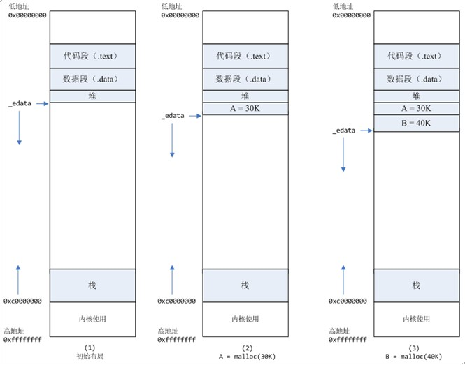
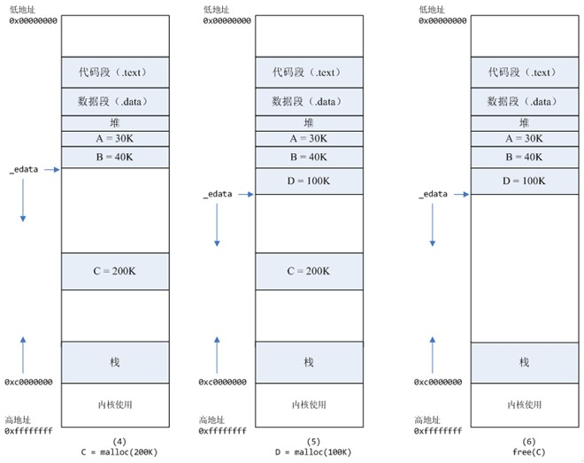
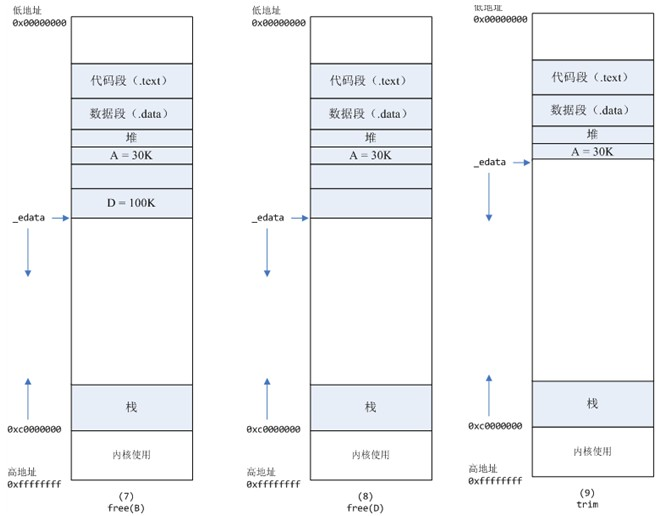

#频繁分配释放内存导致的性能问题的分析 (转)

####现象
1) 	压力测试过程中，发现被测对象性能不够理想，具体表现为： 
	进程的系统态CPU消耗20，用户态CPU消耗10，系统idle大约70
 
2) 	用ps -o majflt,minflt -C program命令查看，发现majflt每秒增量为0，而minflt每秒增量大于10000。

####初步分析
majflt代表major fault，中文名叫大错误，minflt代表minor fault，中文名叫小错误。
这两个数值表示一个进程自启动以来所发生的缺页中断的次数。
当一个进程发生缺页中断的时候，进程会陷入内核态，执行以下操作： 
检查要访问的虚拟地址是否合法 
查找/分配一个物理页 
填充物理页内容（读取磁盘，或者直接置0，或者啥也不干） 
建立映射关系（虚拟地址到物理地址） 
重新执行发生缺页中断的那条指令 
如果第3步，需要读取磁盘，那么这次缺页中断就是majflt，否则就是minflt。 
此进程minflt如此之高，一秒10000多次，不得不怀疑它跟进程内核态cpu消耗大有很大关系。

####分析代码
查看代码，发现是这么写的：一个请求来，用malloc分配2M内存，请求结束后free这块内存。看日志，发现分配内存语句
耗时10us，平均一条请求处理耗时1000us 。 原因已找到！ 虽然分配内存语句的耗时在一条处理请求中耗时比重不大，
但是这条语句严重影响了性能。要解释清楚原因，需要先了解一下内存分配的原理。 

####内存分配的原理
从操作系统角度来看，进程分配内存有两种方式，分别由两个系统调用完成：brk和mmap（不考虑共享内存）。brk是将数据
段(.data)的最高地址指针_edata往高地址推，mmap是在进程的虚拟地址空间中（一般是堆和栈中间）找一块空闲的。这两
种方式分配的都是虚拟内存，没有分配物理内存。在第一次访问已分配的虚拟地址空间的时候，发生缺页中断，操作系统负责
分配物理内存，然后建立虚拟内存和物理内存之间的映射关系。 在标准C库中，提供了malloc/free函数分配释放内存，这
两个函数底层是由brk，mmap，munmap这些系统调用实现的。 
下面以一个例子来说明内存分配的原理：

1)	进程启动的时候，其（虚拟）内存空间的初始布局如图1所示。其中，mmap内存映射文件是在堆和栈的中间（例如libc-2.2.93.so，
	其它数据文件等），为了简单起见，省略了内存映射文件。_edata指针（glibc里面定义）指向数据段的最高地址。
 
2)	进程调用A=malloc(30K)以后，内存空间如图2：malloc函数会调用brk系统调用，将_edata指针往高地址推30K，就完成虚拟内
	存分配。你可能会问：只要把_edata+30K就完成内存分配了？事实是这样的，_edata+30K只是完成虚拟地址的分配，A这块内存现在
	还是没有物理页与之对应的，等到进程第一次读写A这块内存的时候，发生缺页中断，这个时候，内核才分配A这块内存对应的物理页。也
	就是说，如果用malloc分配了A这块内容，然后从来不访问它，那么，A对应的物理页是不会被分配的。
 
3)	进程调用B=malloc(40K)以后，内存空间如图3. 

4)	进程调用C=malloc(200K)以后，内存空间如图4：默认情况下，malloc函数分配内存，如果请求内存大于128K（可由M_MMAP_THRESHOLD
	选项调节），那就不是去推_edata指针了，而是利用mmap系统调用，从堆和栈的中间分配一块虚拟内存。这样子做主要是因为brk分配的内存需
	要等到高地址内存释放以后才能释放（例如，在B释放之前，A是不可能释放的），而mmap分配的内存可以单独释放。当然，还有其它的好处，也
	有坏处，再具体下去，有兴趣的同学可以去看glibc里面malloc的代码了。 

5)	进程调用D=malloc(100K)以后，内存空间如图5. 

6)	进程调用free(C)以后，C对应的虚拟内存和物理内存一起释放 

7)	进程调用free(B)以后，如图7所示。B对应的虚拟内存和物理内存都没有释放，因为只有一个_edata指针，如果往回推，那么D这块内存怎么办
	呢？当然，B这块内存，是可以重用的，如果这个时候再来一个40K的请求，那么malloc很可能就把B这块内存返回回去了。
 
8)	进程调用free(D)以后，如图8所示。B和D连接起来，变成一块140K的空闲内存。
 
9)	默认情况下：当最高地址空间的空闲内存超过128K（可由M_TRIM_THRESHOLD选项调节）时，执行内存紧缩操作（trim）。在上一个步骤free
	的时候，发现最高地址空闲内存超过128K，于是内存紧缩，变成图9所示。

####真相大白
说完内存分配的原理，那么被测模块在内核态cpu消耗高的原因就很清楚了：每次请求来都malloc一块2M的内存，默认情况下，malloc调用mmap
分配内存，请求结束的时候，调用munmap释放内存。假设每个请求需要6个物理页，那么每个请求就会产生6个缺页中断，在2000的压力下，每秒就产
生了10000多次缺页中断，这些缺页中断不需要读取磁盘解决，所以叫做minflt；缺页中断在内核态执行，因此进程的内核态cpu消耗很大。缺页中断
分散在整个请求的处理过程中，所以表现为分配语句耗时（10us）相对于整条请求的处理时间（1000us）比重很小。

####解决办法
将动态内存改为静态分配，或者启动的时候，用malloc为每个线程分配，然后保存在threaddata里面。但是，由于这个模块的特殊性，静态分配，或
者启动时候分配都不可行。另外，Linux下默认栈的大小限制是10M，如果在栈上分配几M的内存，有风险。 
禁止malloc调用mmap分配内存，禁止内存紧缩。
在进程启动时候，加入以下两行代码：
mallopt(M_MMAP_MAX, 0); // 禁止malloc调用mmap分配内存
mallopt(M_TRIM_THRESHOLD, -1); // 禁止内存紧缩
效果：加入这两行代码以后，用ps命令观察，压力稳定以后，majlt和minflt都为0。进程的系统态cpu从20降到10。

####小结
可以用命令ps -o majflt minflt -C program来查看进程的majflt, minflt的值，这两个值都是累加值，从进程启动开始累加。在对高性能
要求的程序做压力测试的时候，我们可以多关注一下这两个值。 
如果一个进程使用了mmap将很大的数据文件映射到进程的虚拟地址空间，我们需要重点关注majflt的值，因为相比minflt，majflt对于性能的损害
是致命的，随机读一次磁盘的耗时数量级在几个毫秒，而minflt只有在大量的时候才会对性能产生影响。
